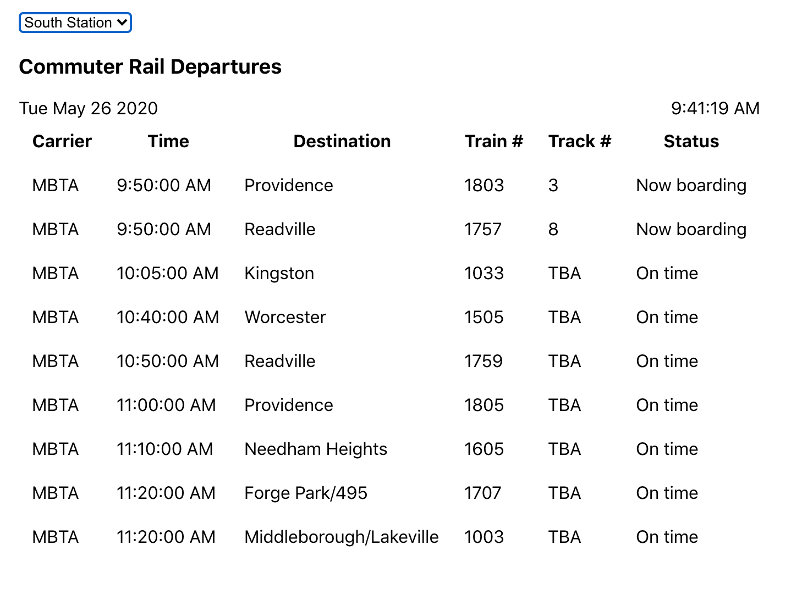

The project is an MBTA departure board built using Flask and React.

It displays data from the MBTA v3 API.

The project requires yarn, python 3.7 and pipenv to be installed.

To install the project dependencies use `yarn install` and `cd server && pipenv install`.

## Available Scripts

In the project directory, you can run:

### `yarn build`

Builds the app for production to the `build` folder. 
It correctly bundles React in production mode and optimizes the build for the best performance.

The build is minified and the filenames include the hashes.

### `yarn start:server`

Starts the flask server using pipenv.
The site can then be visited at localhost:5000

Make sure you build before running the server so the build directory is available for the server to serve to users.

